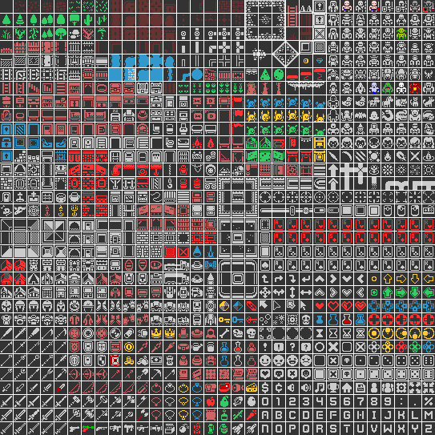

# Codecool Quest

This is a simple tile-based RPG game.

## License
  Apache-2.0

## Opening the project

Open the project in IntelliJ IDEA. This is a Maven project, so you will need to open `pom.xml`.

The project is using JavaFX.  Use the `javafx` maven plugin to build and run the program.

Build:

```bash
mvn javafx:compile
```

Run:

```bash
mvn javafx:run
```

If that doesn't work:
Under "run" tab, go to "Edit Configurations". In the top left corner, "Add New Configuration" Select Maven. After that in the "Command line" copy:
```bash
javafx:compile javafx:run
```

## Controls

* W - move up  
* S - move down  
* A - move left  
* D - move right  
* Enter - pick up item  
* Q - use spell(after cooldown)  

Battle  
With melee weapon: You can attack by colliding with enemies  
With ranged weapon: One of the direction buttons + LShift  

Shop  
To browse the shop you have to stand on the shop icon, and browse with your mouse.  
When you want to make a purchase press Enter

## Enemies/Items

[Codecool Quest Enemies/Items](https://docs.google.com/spreadsheets/d/1f_R9msbECmf3kMlI6T7h_8SzuI71W8-Ue3gUX5Zn_Y8/edit#gid=0)

## Before playing
Please don't pick the Rogue class, it is still work in progress.

## Architecture

The project is meant to teach the concept of **layer separation**. All of the game logic (that is, player movement, game rules, and so on), is in the `logic` package, completely independent of user interface code. In principle, you could implement a completely different interface (terminal, web, Virtual Reality...) for the same logic code.

## Product Backlog

[Codecool Quest Product Backlog](https://docs.google.com/spreadsheets/d/1CvVh2s6obWEh4eQxu8w4f3jBLhz208bG-1FybWGc1sA/edit#gid=0)

## Graphics

The tiles used in the game are from [1-Bit Pack by Kenney](https://kenney.nl/assets/bit-pack), shared on [CC0 1.0 Universal license](https://creativecommons.org/publicdomain/zero/1.0/).



## Authors

* Szentkúti Adrián
* Jeneses Dávid

## Contacts

* szentkuti.adrian@gmail.com
* jenesesd@gmail.com
